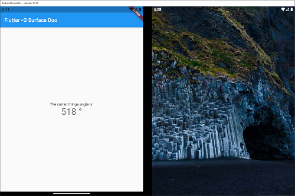

# flutter-surfaceduo-hinge-sample
> A tiny Flutter Android app that displays the current hingle angle of a Surface Duo.

### Prerequisites

* Android Studio
* Flutter SDK and plugin installed
* Surface Duo Emulator

### How it looks

### How to run

1. Clone the repo
2. Start the Surface Duo emulator in Android Studio mode
3. Select the emulator as device in AS
4. Run the app
5. Open the "Additional Sensors" settings pane from the emulator
6. Alternate the `preassure sensor` value which is mapped to the hinge angle

### Contributing

This is a one-time-example, there will maybe no further development (maybe platform verison bumps fixes). That means, no contribution is necessary.

### Authors

Just me, [Tobi]([https://tscholze.github.io).

## Acknowledgments

* [Jonathan Koren](https://github.com/jdkoren)
* [Surface Duo SDK Technet Community](https://techcommunity.microsoft.com/t5/surface-duo-sdk/bd-p/SurfaceDuoSDK) for helping beginners, too.
* [Get Started with Flutter on Surface Duo](https://devblogs.microsoft.com/surface-duo/get-started-with-flutter-on-surface-duo/) Microsoft DevBlog article.

### License

This project is licensed under the MIT License - see the [LICENSE](LICENSE) file for details.
Dependencies or assets maybe licensed differently.
